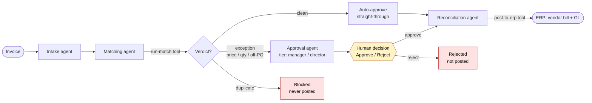

# ledgerloop

Four cooperating AI agents run an invoice through the **procure-to-pay** loop — intake → 2/3-way matching → approval routing → reconciliation — streaming the live agent execution trace as it happens. When a price or quantity mismatch is caught, the run is conditionally routed to approval and **pauses for a real human decision** (Approve / Reject) before anything posts. Built with [Mastra](https://mastra.ai).

### ▶︎ [Try the live demo →](https://ledgerloop-eta.vercel.app/)

[](https://github.com/DylanMerigaud/ledgerloop/actions/workflows/ci.yml)     

---

## What it does



- **Intake** validates and structures the incoming invoice. *(PDF→structured parsing lives in the sibling [ai-invoice-parser](https://github.com/DylanMerigaud/ai-invoice-parser) repo; this one starts from the structured record and focuses on orchestration.)*
- **Matching** runs a 2-way (invoice ↔ PO) or 3-way (invoice ↔ PO ↔ goods receipt) match → verdict: `clean`, `exception`, or `duplicate`.
- **Conditional routing** — clean goes straight through; an exception is routed to the Approval agent (tiered manager/director by the money + variance at stake) and **pauses for a human**; a duplicate is blocked so it's never paid twice.
- **Reconciliation** posts the vendor bill + double-entry GL to the ERP — only once an invoice is cleared (auto or human-approved).

The split-view dashboard shows the **invoice queue** (color-coded by outcome) and the **live agent execution trace** for the selected invoice — each agent step, each tool call, the caught mismatch, and the pause where you click Approve / Reject — streamed as the agents run.

### Seeded scenarios

~10 realistic invoices, including three deliberate edge cases — these are the demo:

| Invoice | Scenario | Outcome |
| --- | --- | --- |
| `INV-2042` | Price mismatch — steel bar invoiced ~9% over the PO | `price_variance` → manager approval → **pauses for your decision** |
| `INV-2048` | Quantity mismatch — invoiced 100 units, only 80 received | 3-way receipt check → director approval → **pauses for your decision** |
| `INV-2041` (re-send) | Duplicate — same invoice number twice | `duplicate` → **blocked**, not posted |
| 6 × clean | Clean 2/3-way matches | auto-approved → straight-through |

---

## How it's built

**Mastra workflow with conditional branching.** The pipeline ([`src/mastra/workflows/p2p.ts`](src/mastra/workflows/p2p.ts)) chains four typed steps and routes on the matching verdict via `.branch(...)` — clean skips approval, exceptions go through the human gate, duplicates are blocked. That branch is the orchestration the demo exists to show.

**Four real agents with tools.** Each stage is an [`Agent`](src/mastra/agents) (`@mastra/core/agent`) with focused instructions and its own tool, resolved from the central [`Mastra`](src/mastra/index.ts) registry — not one prompt pretending to be many. One model id ([`src/mastra/model.ts`](src/mastra/model.ts)) via Mastra's built-in router (`"anthropic/claude-haiku-4-5"`); a small/fast Claude keeps a full run to a few seconds.

**LLMs for language, code for the numbers.** Whether an invoice is a 9%-over price variance, a duplicate, or which approval tier applies isn't a language problem — it's arithmetic and policy. So the verdict comes from pure, unit-tested functions ([`lib/matching.ts`](lib/matching.ts), [`lib/policy.ts`](lib/policy.ts), [`lib/erp.ts`](lib/erp.ts)) — exact, instant, cheap, auditable. The agent genuinely *calls* these as tools (a real `tool-call` you watch in the trace) and writes the human narration; the deterministic result is what drives the routing. The tool reads the trusted documents from `requestContext`, not from model-generated args. If the model is slow or unavailable, the routing still stands — only the prose degrades.

**A real human-in-the-loop, statelessly.** On an exception the run pauses before reconciliation (`awaiting`) and the ERP post does not happen until a human clicks Approve. The demo never writes to the database, yet a pause normally needs a persisted run to resume — so instead of a stored snapshot, the Approve/Reject click fires a second request that recomputes the cheap deterministic prefix and continues into reconciliation, gated by a `humanApproval` input ([`app/api/run/route.ts`](app/api/run/route.ts)). Mastra's native `suspend`/`resume` would need durable storage across two serverless requests; recomputing a pure prefix is the stateless-friendly choice.

**Zod as the single source of truth.** Every shape is defined once in Zod ([`lib/schema.ts`](lib/schema.ts)): it constrains the model, validates every boundary at runtime (`safeParse` — a bad value becomes a handled trace step, never a crash), and its inferred types flow into Drizzle, the workflow steps, the stream, and the UI. The model, validator, database, and screen can't drift.

**Streaming, relayed and adapted.** The route relays Mastra's native `run.stream()` to the browser as NDJSON; a small adapter ([`lib/trace.ts`](lib/trace.ts)) maps raw chunks to a stable `TraceEvent` so the UI depends on our vocabulary, not Mastra's internals, and an unrecognized chunk is dropped rather than crashing the stream.

### Stateless by design

The seeded data is read-only. "Run pipeline" executes the agents server-side, streams the trace, and **forgets** — it writes nothing, so the 50th visitor sees the same pristine state as the 1st. (The `agent_runs` table is modelled as the canonical persisted shape of a run, but intentionally left empty; the live trace is rendered from the stream.)

### Project layout

```
src/mastra/
  index.ts            registry (4 agents + the workflow)
  model.ts            one model id (router string)
  agents/             intake · matching · approval · reconciliation
  tools/              tools that read input from requestContext + run the pure logic
  workflows/p2p.ts    the chain + .branch() conditional routing
  workflows/run-agent-step.ts   invoke agent → fire tool + narrate; rules stay authoritative
  testing/            mock model + offline integration tests
lib/
  matching.ts · policy.ts · erp.ts   pure, unit-tested decision logic
  schema.ts           Zod source of truth → types + JSON schema
  trace.ts · ndjson.ts   stream adapter + framing
db/
  schema.ts · seed-data.ts · seed.ts · client.ts   Drizzle + read-only query layer
```

> **Node runtime, not Edge** for the streaming route: the Postgres driver needs TCP sockets Edge lacks, and Vercel's Node functions stream fine with a configurable `maxDuration` — so the spec's "no timeout on chained agents" goal is met without an Edge-only DB driver.

> **The ERP is a stub with a real interface** ([`lib/erp.ts`](lib/erp.ts)): swap `fakeErp` for a `NetSuiteAdapter` of the same `ErpAdapter` and the agent is unchanged. Keeps the public demo self-contained.

---

## Quality gates

Run in [CI](.github/workflows/ci.yml) on every push/PR:

- `pnpm typecheck` — `tsc --noEmit`, strict + `noUncheckedIndexedAccess` / `noUnusedLocals` / `noUnusedParameters`
- `pnpm knip` — dead code across the project (unused exports, files, deps)
- `pnpm test` — Node's built-in runner: the pure decision logic, every seeded edge case routing to its intended verdict, and an offline integration test that runs the real workflow against a **mock model** (proves the agent→tool→trace wiring with no API key)
- `pnpm build` — Next.js production build
- `pnpm sanity --dry-run` — the full deterministic pipeline over every seeded invoice, no API calls (what CI runs instead of the live agents)

`pnpm e2e` is a **Playwright** test that drives the real app + real backend through the human-in-the-loop flow (run → pause → Approve/Reject). It needs the secrets and spends tokens, so it's local-only — run before a deploy. Dependencies are pinned exactly; package manager is **pnpm**.

---

## Getting started

```bash
pnpm install
cp .env.example .env.local        # fill in ANTHROPIC_API_KEY + DATABASE_URL
pnpm db:push                      # create the tables
pnpm db:seed                      # load the invoices + edge cases
pnpm dev                          # http://localhost:3000
```

| Variable | Required | Purpose |
| --- | --- | --- |
| `ANTHROPIC_API_KEY` | **yes** | The agents (Claude Haiku via Mastra's router) |
| `DATABASE_URL` | **yes** | Supabase Postgres — use the **transaction pooler** string |
| `DIRECT_DATABASE_URL` | optional | Direct (non-pooled) string for `db:push` / `db:seed` |

> **Set a spend cap on the Anthropic key** — the deployed demo is public and the run button calls the model. (It's also rate-limited per IP via Upstash if `KV_REST_API_*` / `UPSTASH_*` are set; it fails open without them.)

**Deploy to Vercel:** import the repo, set `ANTHROPIC_API_KEY` + `DATABASE_URL`, and run `pnpm db:push && pnpm db:seed` once against the same database. The `/api/run` route runs on the Node runtime with `maxDuration = 60`.

---

## Notes & what's next

This is a finished, deployable **demo** — the matching/routing/policy logic is production-grade (pure, typed, unit-tested), wrapped in a deliberately stateless showcase with a fake ERP. Productionizing it is additive, not a rewrite: swap the fake adapter for a real one, add persistence + an audit trail (the `agent_runs` table is already shaped for it), and wire real approver identity. Other natural next steps: a confidence/why trail per matched line, and batch processing of a whole queue.

---

## Contact

I build production-grade AI features fast — freelance / contract, fintech & AI.

- **Live demo** — <https://ledgerloop-eta.vercel.app/>
- **GitHub** — [@DylanMerigaud](https://github.com/DylanMerigaud)
- **LinkedIn** — [in/dylanmerigaud](https://www.linkedin.com/in/dylanmerigaud/)
- **Email** — [dylanmerigaud.pro@gmail.com](mailto:dylanmerigaud.pro@gmail.com)

## License

[MIT](LICENSE)
