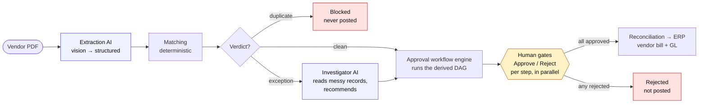

# ledgerloop

A **procure-to-pay** product in two halves. **Onboarding**: connect a client's HRIS and an agent derives their approval workflow — who signs off on what — resolved to real people from the org chart, with the data-quality problems flagged for a human to fix. **Operations**: a vendor PDF comes in, gets extracted, matched, and run through that workflow, with a live execution trace you watch as it happens.

AI is used in the places it earns its keep, and nowhere else. **Extraction** reads the messy vendor PDF into structured data (vision). **Onboarding discovery** maps an org's titles to approval authority (genuinely fuzzy judgement). **Investigation** judges a flagged exception against unstructured records and recommends. Everything else — matching, the workflow engine, reconciliation — is deterministic code, because a payment decision must be exact and repeatable, never a model's guess. Nothing posts until a human approves. Built with [Mastra](https://mastra.ai).

The differentiator vs the workflow builders (Ramp, Zip, Pivot): you don't draw the approval graph on a canvas by hand. **The agent derives it from the HRIS, and you maintain it in plain language** — "above $25k also require CFO approval" — with a preview you approve or revert.

### ▶︎ [Try the live demo →](https://ledgerloop-eta.vercel.app/)

[](https://github.com/DylanMerigaud/ledgerloop/actions/workflows/ci.yml)     


---

## Onboarding — the agent derives the approval workflow

The forward-deployed-engineer step, made self-serve. Click **Discover from BambooHR** and:

1. The HRIS adapter reads the client's org (one `POST /reports/custom` → the whole roster with ID-based reporting edges).
2. The onboarding agent derives a **conditional approval workflow** — a manager gate, a director gate above an amount threshold, a department review — and **resolves each role to a real person** from the org chart.
3. It **flags the data-quality issues** a human must fix first: a manager who's been terminated, two people who both look like the CEO, junk records with no title. (The seeded org plants these on purpose; the real 91-person BambooHR sample throws up eight of its own.)

The result is a **proposal**: you review the resolved approvers and the flagged issues, then edit the workflow conversationally before it goes live. The agent decides nothing on its own.

**Conversational editing, with preview → approve / revert.** Tell the agent what you want and it proposes a rewrite; the graph shows the diff (added / changed / removed gates) and **nothing is applied until you approve** — the pipeline only ever runs the workflow you've approved.

- The DAG **structure** is a deterministic template; the agent only makes the fuzzy calls (which title fills which approval level → which person, what threshold, plain-language issue notes). Code assembles those into a Zod-validated `ApprovalWorkflow`. An edit that would produce an invalid graph is rejected, never applied.
- `lib/onboarding.ts` (derive + assemble), `lib/onboarding-model.ts` (the structured-output call), `lib/workflow-edit.ts` (conversational edits + diff), `app/api/onboarding`, `app/api/workflow/edit`.

---

## Operations — an invoice through the workflow



- **Extraction (AI)** — the vendor's invoice PDF is read by a vision model into a schema-validated `Invoice`. The extracted invoice is what the rest of the pipeline runs on — matching joins the extracted lines against the PO, like production.
- **Matching** — a 2-way (invoice ↔ PO) or 3-way (invoice ↔ PO ↔ goods receipt) match, returning `clean`, `exception`, or `duplicate`.
- **Investigation** — runs only on an exception, and the one open-ended agent in the operational path. A number ("9% over the PO") doesn't tell a reviewer whether it's a legitimate price increase or an overcharge; that lives in unstructured records, and which records matter depends on what you find. The agent **chooses** which tools to call, reads them, and recommends. It decides nothing about the money.
- **Approval workflow engine** — the invoice runs through the client's derived DAG ([`lib/approval-engine.ts`](lib/approval-engine.ts)): each gate's condition is evaluated, the active gates **pause for a human** (several can be pending in parallel — a fan-out), and the bill posts only once **every** active gate is approved. One rejection blocks everything downstream. A clean invoice trips no gate and goes straight through.
- **Reconciliation** — posts the vendor bill and double-entry GL to the ERP, only once cleared.

The split-view dashboard shows the **invoice queue** (color-coded by outcome) and the **live execution trace** — each step, the agent's tool calls and recommendation, and the workflow graph coloured by the path this invoice took (approved / pending / skipped / blocked).

### Seeded scenarios

~10 realistic invoices, including three deliberate edge cases:

| Invoice | Scenario | Outcome |
| --- | --- | --- |
| `INV-2042` | Price mismatch — steel bar invoiced ~9% over the PO | `price_variance` → manager gate → **pauses for your decision** |
| `INV-2048` | Quantity mismatch — invoiced 100 units, only 80 received | 3-way receipt check → manager gate → **pauses for your decision** |
| `INV-2041` (re-send) | Duplicate — same invoice number twice | `duplicate` → **blocked**, not posted |
| 6 × clean | Clean 2/3-way matches | no gate → straight-through |

---

## How it's built

**AI at the edges, deterministic code in the core.** The ends are language/perception/judgement problems — reading a PDF, mapping titles to approval authority, judging a fuzzy exception — so they use a model. The middle (is this a 9%-over variance? which gates apply? did every gate approve?) is arithmetic and graph logic, so it's pure, unit-tested functions ([`lib/matching.ts`](lib/matching.ts), [`lib/approval-workflow.ts`](lib/approval-workflow.ts), [`lib/approval-engine.ts`](lib/approval-engine.ts), [`lib/erp.ts`](lib/erp.ts)): exact, auditable, identical on every run. An LLM never decides a payment amount.

**The conditional approval workflow.** Approval isn't a single tier — it's a DAG of conditional gates ([`lib/approval-workflow.ts`](lib/approval-workflow.ts)): each step carries a `when` condition (amount / variance / department / verdict, combinable with all/any) and parallel `next` edges. The engine ([`lib/approval-engine.ts`](lib/approval-engine.ts)) walks it per invoice with collect-all semantics: a skipped gate is a transparent pass-through, several gates can pend at once, one rejection blocks downstream. The per-client config lives in a `ClientProfile` ([`lib/client-profile.ts`](lib/client-profile.ts)); an un-onboarded profile derives a behaviour-equivalent DAG from simple thresholds, so the old flat tiering is a strict subset.

**The HRIS adapter is real, captured, replayed.** [`lib/hris.ts`](lib/hris.ts) reads BambooHR (`bambooHris`, live HTTP) or replays a fixture captured from that same API (`recordedHris`); one `defaultHris()` factory picks live-vs-recorded — the only place that branch exists. The committed fixture in [`db/fixtures/bamboohr/`](db/fixtures/bamboohr/) is **real BambooHR output**, captured on a dated run via `pnpm hris:capture` — not a mock — so the demo (and CI, which has no key) runs on real data and survives the trial key expiring. `pnpm hris:seed` / `hris:reset` stand up a curated org in a sandbox (scoped by a dedicated Division, server-side, so reset only removes what it created).

**The investigator agent.** [`src/mastra/agents/investigator.ts`](src/mastra/agents/investigator.ts) is a Mastra `Agent` with three tools returning deliberately unstructured records. It runs an open-ended loop — picks which tools to call, reads them, writes a recommendation (`likely_legitimate` / `likely_overcharge` / `unclear`) — and only *recommends*; the engine and the human gate own the outcome. Tools read the trusted vendor from `requestContext`, not model args, so the agent can't pull the wrong vendor's file.

**A real human-in-the-loop, statelessly.** On an exception the run pauses before reconciliation (`awaiting`) and the post doesn't happen until a human approves the pending gate(s). The demo never writes to the database, yet a pause normally needs a persisted run to resume — so instead the Approve/Reject click sends per-step decisions (`{ "director-review": "approve" }`) that recompute the cheap deterministic prefix and continue, gated in [`app/api/run/route.ts`](app/api/run/route.ts).

**Zod as the single source of truth.** Every shape is defined once in Zod ([`lib/schema.ts`](lib/schema.ts), [`lib/approval-workflow.ts`](lib/approval-workflow.ts)): it constrains the model, validates every boundary at runtime (`safeParse`), and its inferred types flow into Drizzle, the workflow, the stream, and the UI. **Env is typed too** ([`lib/env.ts`](lib/env.ts), `@t3-oss/env-nextjs`): everything reads `env`, never `process.env`.

**Streaming, relayed and adapted.** The route relays Mastra's `run.stream()` as NDJSON; a small adapter ([`lib/trace.ts`](lib/trace.ts)) maps raw chunks to a stable `TraceEvent` so the UI depends on our vocabulary, not Mastra's internals, and a junk chunk is dropped rather than crashing the stream.

### Stateless by design

The seeded data is read-only. "Run pipeline" executes server-side, streams the trace, and **forgets** — so the 50th visitor sees the same pristine state as the 1st. (The `agent_runs` table is modelled as the canonical persisted shape of a run but intentionally left empty.)

### Project layout

```
src/mastra/
  index.ts                 registry (the investigator agent + the workflow)
  agents/investigator.ts   the one operational agent — exception investigation
  tools/                   investigator tools (trusted input from requestContext)
  workflows/p2p.ts         the chain + .branch(); deterministic steps + the agent
lib/
  approval-workflow.ts     the conditional DAG model + condition evaluator + diff
  approval-engine.ts       executes the DAG per invoice (fan-out, collect-all)
  onboarding.ts            derive a workflow from an org (+ onboarding-model.ts)
  workflow-edit.ts         conversational edits + diff (+ workflow-edit-model.ts)
  hris.ts                  BambooHR adapter: live + recorded, one factory
  client-profile.ts        per-client config; flat policy → DAG bridge
  matching.ts · erp.ts     pure, unit-tested decision logic
  extract.ts               vision extraction (invoice PDF → validated Invoice)
  schema.ts · env.ts       Zod source of truth; typed env
  logger.ts · api-routes.ts · trace.ts   logging; endpoints; stream adapter
app/api/
  run/ · onboarding/ · workflow/edit/ · pdf/[id]/
db/
  schema.ts · seed-data.ts · client.ts · fixtures/bamboohr/   Drizzle + real fixture
config/eslint-rules/        custom lint rules (no-console, api-routes, …)
```

> **The ERP is a stub with a real interface** ([`lib/erp.ts`](lib/erp.ts)): swap `fakeErp` for a `NetSuiteAdapter` of the same `ErpAdapter` and the rest is unchanged. The integration steps (Slack/Jira) are likewise honest stubs; NetSuite is the one with a real adapter seam.

---

## Quality gates

Run in [CI](.github/workflows/ci.yml) on every push/PR:

- `pnpm typecheck` — `tsc --noEmit`, strict + `noUncheckedIndexedAccess` / `noUnusedLocals`
- `pnpm lint` — ESLint (type-aware), aligned with the sibling repo's config: no `any`, no bare `!`, no `as unknown as`, typed env over `process.env`, the logger over `console`, kebab-case files, arrow style, organised imports (see [`eslint.config.mts`](eslint.config.mts))
- `pnpm knip` — dead code across the project (unused exports, files, deps)
- `pnpm test` — Node's built-in runner: the pure decision logic (matching, the workflow engine, the policy→DAG bridge), every seeded edge case, and an offline integration test that runs the real workflow against a **mock model** (the agent→tool→trace wiring, no API key)
- `pnpm build` — Next.js production build
- `pnpm sanity --dry-run` — the full deterministic pipeline over every seeded invoice, no API calls
- `pnpm eval --dry-run` — validates the investigator eval corpus + scoring offline

**Evaluating the agent.** `pnpm eval` ([`eval/`](eval/)) runs the **real investigator** over a labelled corpus and scores its recommendation — accuracy plus precision/recall on catching overcharges. `sanity` proves the deterministic routing; `eval` proves the agent's judgement. It needs a key, so it's local; CI runs `--dry-run`.

`pnpm e2e` is a **Playwright** test driving the real app through the human-in-the-loop flow (run → pause → Approve/Reject). Local-only. Dependencies are pinned exactly; package manager is **pnpm**.

---

## Getting started

```bash
pnpm install
cp .env.example .env.local        # fill in ANTHROPIC_API_KEY + DATABASE_URL
pnpm db:push                      # create the tables
pnpm db:seed                      # load the invoices + edge cases
pnpm dev                          # http://localhost:3000
```

| Variable | Required | Purpose |
| --- | --- | --- |
| `ANTHROPIC_API_KEY` | **yes** | Extraction (Sonnet vision), the onboarding + edit models (Sonnet), the investigator (Haiku) |
| `DATABASE_URL` | **yes** | Supabase Postgres — use the **transaction pooler** string |
| `DIRECT_DATABASE_URL` | optional | Direct (non-pooled) string for `db:push` / `db:seed` |
| `BAMBOO_HR_API_KEY` + `BAMBOO_HR_SUBDOMAIN` | optional | Live BambooHR. **Without them onboarding replays the committed real fixture** — the demo and CI work with no key. |
| `UPSTASH_*` / `KV_REST_API_*` | optional | Per-IP rate limiting; fails open without it |

> **Set a spend cap on the Anthropic key** — the deployed demo is public and the buttons call the model.

**Deploy to Vercel:** import the repo, set `ANTHROPIC_API_KEY` + `DATABASE_URL`, run `pnpm db:push && pnpm db:seed` once against the same database. The API routes run on the Node runtime with `maxDuration = 60`.

---

## What's next

A stateless demo with a fake ERP; the decision logic is pure, typed, and unit-tested. Production is additive, not a rewrite:

- swap the fake ERP / integration stubs for real adapters (same interfaces),
- live BambooHR (the adapter + a captured fixture already exist; a dev key with field-edit permissions unlocks self-serve seeding) and a second HRIS behind the same `HrisAdapter`,
- add persistence and an audit trail (the `agent_runs` table is shaped for it),
- wire real approver identity to the per-step gates,
- accept real uploaded PDFs at intake.

---

## Contact

I build production-grade AI features fast — freelance / contract, fintech & AI.

- **Live demo** — <https://ledgerloop-eta.vercel.app/>
- **GitHub** — [@DylanMerigaud](https://github.com/DylanMerigaud)
- **LinkedIn** — [in/dylanmerigaud](https://www.linkedin.com/in/dylanmerigaud/)
- **Email** — [dylanmerigaud.pro@gmail.com](mailto:dylanmerigaud.pro@gmail.com)

## License

[MIT](LICENSE)
