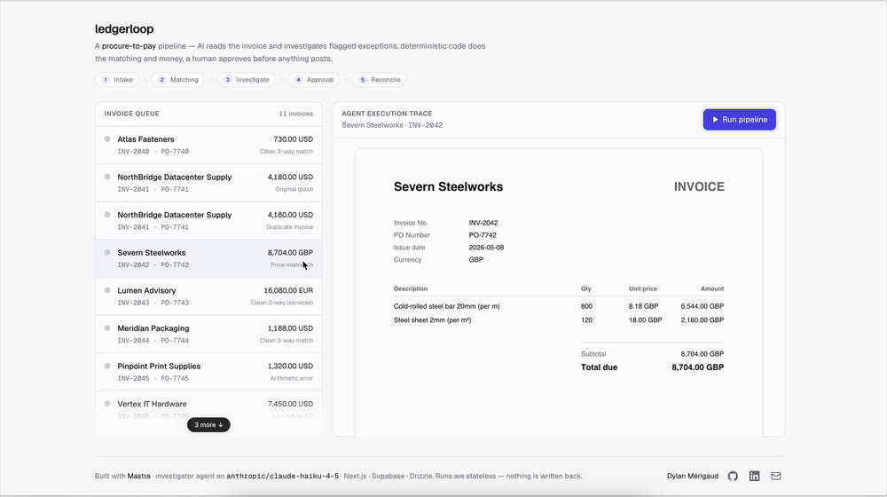
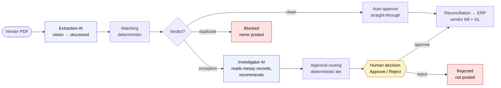

# ledgerloop

An invoice **procure-to-pay** pipeline: a vendor PDF comes in, gets extracted, matched, routed, and reconciled, with a live execution trace you watch as it runs.

AI is used in the two places it earns its keep, and nowhere else. **Extraction** reads the messy vendor PDF into structured data (vision). **Investigation** judges a flagged exception against unstructured records, recommends, and a human decides. Everything in between — matching, approval tiering, reconciliation — is deterministic code, because a payment decision must be exact and repeatable, never a model's guess. Nothing posts until a human approves. Built with [Mastra](https://mastra.ai).

### ▶︎ [Try the live demo →](https://ledgerloop-eta.vercel.app/)

[](https://github.com/DylanMerigaud/ledgerloop/actions/workflows/ci.yml)     



---

## What it does



- **Extraction (AI)** — the vendor's invoice PDF is read by a vision model into a schema-validated `Invoice`. You watch the document get scanned and the fields fill in. (The seeded pipeline then runs on the trusted record, so a model misread degrades the reveal, never the downstream verdicts — see below.)
- **Matching** — a 2-way (invoice ↔ PO) or 3-way (invoice ↔ PO ↔ goods receipt) match, returning a verdict: `clean`, `exception`, or `duplicate`.
- **Investigation** — runs only on an exception, and the one step that's an agent. A number ("9% over the PO") doesn't tell a reviewer whether it's a legitimate price increase or an overcharge; that lives in unstructured records, and which records matter depends on what you find. The agent **chooses** which tools to call, reads the records, and writes a recommendation. It decides nothing about the money.
- **Approval routing** — tiers an exception (manager / director by the money and variance at stake) and **pauses for a human**; a duplicate is blocked so it's never paid twice; a clean match skips straight through.
- **Reconciliation** — posts the vendor bill and double-entry GL to the ERP, only once the invoice is cleared (auto or human-approved).

The split-view dashboard shows the **invoice queue** (color-coded by outcome) and the **live execution trace** for the selected invoice — each step, the agent's tool calls and its recommendation, the caught mismatch, and the pause where you click Approve / Reject.

### Seeded scenarios

~10 realistic invoices, including three deliberate edge cases — these are the demo:

| Invoice | Scenario | Outcome |
| --- | --- | --- |
| `INV-2042` | Price mismatch — steel bar invoiced ~9% over the PO | `price_variance` → manager approval → **pauses for your decision** |
| `INV-2048` | Quantity mismatch — invoiced 100 units, only 80 received | 3-way receipt check → director approval → **pauses for your decision** |
| `INV-2041` (re-send) | Duplicate — same invoice number twice | `duplicate` → **blocked**, not posted |
| 6 × clean | Clean 2/3-way matches | auto-approved → straight-through |

---

## How it's built

**AI at the edges, deterministic code in the core.** The two ends of the pipeline are language/perception problems — reading a messy PDF, judging a fuzzy exception — so they use a model. The middle (is this a 9%-over variance? a duplicate? which approval tier?) is arithmetic and policy, so it's pure, unit-tested functions ([`lib/matching.ts`](lib/matching.ts), [`lib/policy.ts`](lib/policy.ts), [`lib/erp.ts`](lib/erp.ts)): exact, auditable, identical on every run. An LLM never decides a payment amount.

**Extraction reads the document; the record decides.** The vendor's PDF is rendered ([`lib/invoice-pdf.ts`](lib/invoice-pdf.ts)) and read by a vision model into a schema-validated `Invoice` ([`lib/extract.ts`](lib/extract.ts), `Invoice.safeParse`). Here's the deliberate part: the extracted invoice is *shown* (the reveal proves the read happened), but the downstream pipeline runs on the **trusted seeded record**, not the model's output. So a misread degrades the reveal, never the verdicts — the demo's edge cases stay reliable. It also fails open: if the model is slow or down, the run notes it and proceeds on the record. In production you'd reconcile extraction against the PO and surface the diff; the seam is the same.

**The investigator agent.** [`src/mastra/agents/investigator.ts`](src/mastra/agents/investigator.ts) is a Mastra [`Agent`](https://mastra.ai) with three tools — `get-vendor-price-history`, `get-po-notes`, `get-receipt-notes` — returning deliberately unstructured, free-text records ([`lib/vendor-context.ts`](lib/vendor-context.ts)). It runs an open-ended loop: it picks which tools to call and in what order (a quantity problem pulls the receipt notes first; a price problem pulls the price history), reads them, and writes a recommendation (`likely_legitimate` / `likely_overcharge` / `unclear`). It only *recommends* — the deterministic routing and the human gate own the outcome, so a wrong call is caught by the reviewer. Each tool call and the recommendation appear live on the trace. Tools read the trusted vendor from `requestContext`, not model-generated args, so the agent can't pull the wrong vendor's file. Model id lives in one place ([`src/mastra/model.ts`](src/mastra/model.ts)), resolved by Mastra's router (`"anthropic/claude-haiku-4-5"`).

**A real human-in-the-loop, statelessly.** On an exception the run pauses before reconciliation (`awaiting`) and the ERP post does not happen until a human clicks Approve. The demo never writes to the database, yet a pause normally needs a persisted run to resume — so instead of a stored snapshot, the Approve/Reject click fires a second request that recomputes the cheap deterministic prefix and continues into reconciliation, gated by a `humanApproval` input ([`app/api/run/route.ts`](app/api/run/route.ts)). Mastra's native `suspend`/`resume` would need durable storage across two serverless requests; recomputing a pure prefix is the stateless-friendly choice.

**Zod as the single source of truth.** Every shape is defined once in Zod ([`lib/schema.ts`](lib/schema.ts)): it constrains the model, validates every boundary at runtime (`safeParse` — a bad value becomes a handled trace step, never a crash), and its inferred types flow into Drizzle, the workflow steps, the stream, and the UI. The model, validator, database, and screen can't drift.

**Streaming, relayed and adapted.** The route relays Mastra's native `run.stream()` to the browser as NDJSON; a small adapter ([`lib/trace.ts`](lib/trace.ts)) maps raw chunks to a stable `TraceEvent` so the UI depends on our vocabulary, not Mastra's internals, and an unrecognized chunk is dropped rather than crashing the stream.

### Stateless by design

The seeded data is read-only. "Run pipeline" executes server-side, streams the trace, and **forgets** — it writes nothing, so the 50th visitor sees the same pristine state as the 1st. (The `agent_runs` table is modelled as the canonical persisted shape of a run, but intentionally left empty; the live trace is rendered from the stream.)

### Project layout

```
src/mastra/
  index.ts            registry (the investigator agent + the workflow)
  model.ts            one model id (router string)
  agents/investigator.ts   the one agent — open-ended exception investigation
  tools/              investigator tools (read trusted input from requestContext)
  workflows/p2p.ts    the chain + .branch() routing; deterministic steps + the agent
  testing/            mock model + offline integration tests
lib/
  matching.ts · policy.ts · erp.ts   pure, unit-tested decision logic
  extract.ts          vision extraction (invoice PDF → validated Invoice)
  invoice-pdf.ts      render an Invoice to a PDF (so there's a real doc to read)
  vendor-context.ts   the messy free-text records the agent reasons over
  schema.ts           Zod source of truth → types + JSON schema
  trace.ts · ndjson.ts   stream adapter + framing
app/api/
  run/                streams the run (extraction → pipeline → trace)
  pdf/[id]/           renders the invoice PDF on demand
db/
  schema.ts · seed-data.ts · seed.ts · client.ts   Drizzle + read-only query layer
```

> **Node runtime, not Edge** for the streaming route: the Postgres driver needs TCP sockets Edge lacks, and Vercel's Node functions stream fine with a configurable `maxDuration` — so a long, non-timing-out stream works without an Edge-only DB driver.

> **The ERP is a stub with a real interface** ([`lib/erp.ts`](lib/erp.ts)): swap `fakeErp` for a `NetSuiteAdapter` of the same `ErpAdapter` and the rest is unchanged. Keeps the public demo self-contained.

---

## Quality gates

Run in [CI](.github/workflows/ci.yml) on every push/PR:

- `pnpm typecheck` — `tsc --noEmit`, strict + `noUncheckedIndexedAccess` / `noUnusedLocals` / `noUnusedParameters`
- `pnpm knip` — dead code across the project (unused exports, files, deps)
- `pnpm test` — Node's built-in runner: the pure decision logic, every seeded edge case routing to its intended verdict, and an offline integration test that runs the real workflow against a **mock model** (proves the agent→tool→trace wiring with no API key)
- `pnpm build` — Next.js production build
- `pnpm sanity --dry-run` — the full deterministic pipeline over every seeded invoice, no API calls (what CI runs instead of the live agent)
- `pnpm eval --dry-run` — validates the investigator eval corpus + scoring offline (CI); the live `pnpm eval` scores the real agent (below)

**Evaluating the agent.** `pnpm eval` ([`eval/`](eval/)) runs the **real investigator** over a labelled corpus of exceptions and scores its recommendation — overall accuracy plus precision/recall on catching overcharges (a missed overcharge is the expensive error). It's the agent counterpart to `sanity`: `sanity` proves the deterministic routing, `eval` proves the agent's judgment. It needs a key and spends tokens, so it's local; CI runs `--dry-run` (which stubs the agent with ground truth to exercise the corpus + scoring).

`pnpm e2e` is a **Playwright** test that drives the real app + real backend through the human-in-the-loop flow (run → pause → Approve/Reject). It needs the secrets and spends tokens, so it's local-only — run before a deploy. Dependencies are pinned exactly; package manager is **pnpm**.

---

## Getting started

```bash
pnpm install
cp .env.example .env.local        # fill in ANTHROPIC_API_KEY + DATABASE_URL
pnpm db:push                      # create the tables
pnpm db:seed                      # load the invoices + edge cases
pnpm dev                          # http://localhost:3000
```

| Variable | Required | Purpose |
| --- | --- | --- |
| `ANTHROPIC_API_KEY` | **yes** | Extraction (Claude Sonnet vision) + the investigator agent (Claude Haiku via Mastra's router) |
| `DATABASE_URL` | **yes** | Supabase Postgres — use the **transaction pooler** string |
| `DIRECT_DATABASE_URL` | optional | Direct (non-pooled) string for `db:push` / `db:seed` |

> **Set a spend cap on the Anthropic key** — the deployed demo is public and the run button calls the model. (It's also rate-limited per IP via Upstash if `KV_REST_API_*` / `UPSTASH_*` are set; it fails open without them.)

**Deploy to Vercel:** import the repo, set `ANTHROPIC_API_KEY` + `DATABASE_URL`, and run `pnpm db:push && pnpm db:seed` once against the same database. The `/api/run` route runs on the Node runtime with `maxDuration = 60`.

---

## What's next

This is a stateless demo with a fake ERP; the decision logic (matching, routing, policy) is pure, typed, and unit-tested. Taking it to production is additive, not a rewrite:

- swap the fake ERP adapter for a real one (same `ErpAdapter` interface),
- add persistence and an audit trail (the `agent_runs` table is already shaped for it),
- wire real approver identity to the human gate,
- make extraction authoritative — reconcile the extracted invoice against the PO and surface the diff for review, rather than running on the seeded record,
- batch processing across the whole queue.

---

## Contact

I build production-grade AI features fast — freelance / contract, fintech & AI.

- **Live demo** — <https://ledgerloop-eta.vercel.app/>
- **GitHub** — [@DylanMerigaud](https://github.com/DylanMerigaud)
- **LinkedIn** — [in/dylanmerigaud](https://www.linkedin.com/in/dylanmerigaud/)
- **Email** — [dylanmerigaud.pro@gmail.com](mailto:dylanmerigaud.pro@gmail.com)

## License

[MIT](LICENSE)
